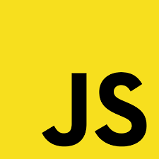
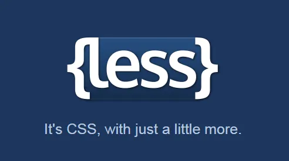

### 
Personal skills    
Vue VueUse Vuex  Vue-Router  
HTML CSS3 Less Scss JavaScript ES6  
Jquery DOM BOM  Flex    
Bootstrop Element Element-plus Vant echarts  
Axios Js-Server Mock Swiper Js-Cookies Day.js 
###
To understand  
But it can be developed  
Vue3 React Typescript Canvas...
###  

